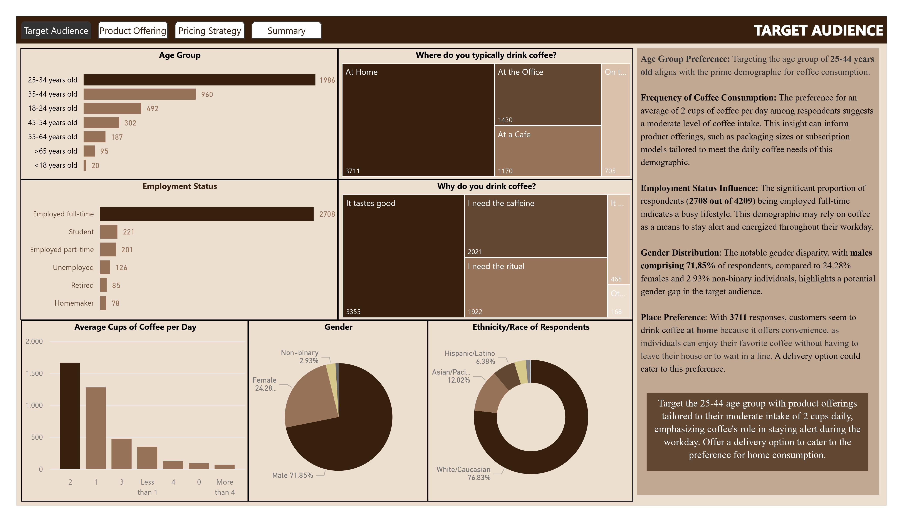
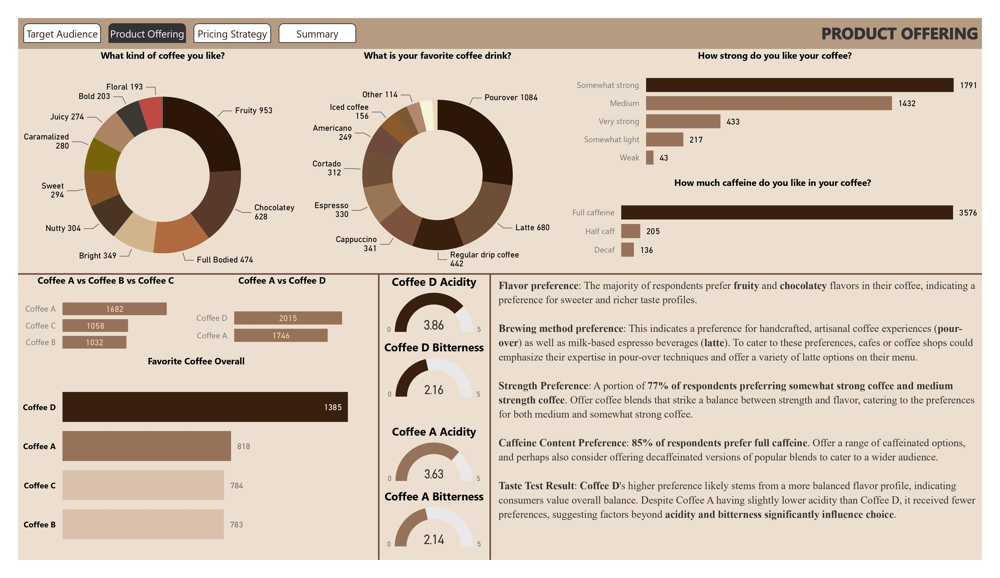
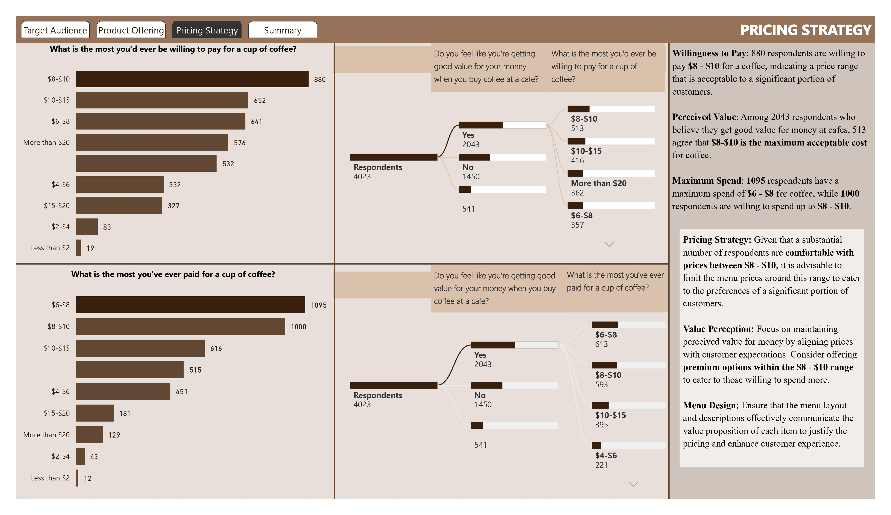
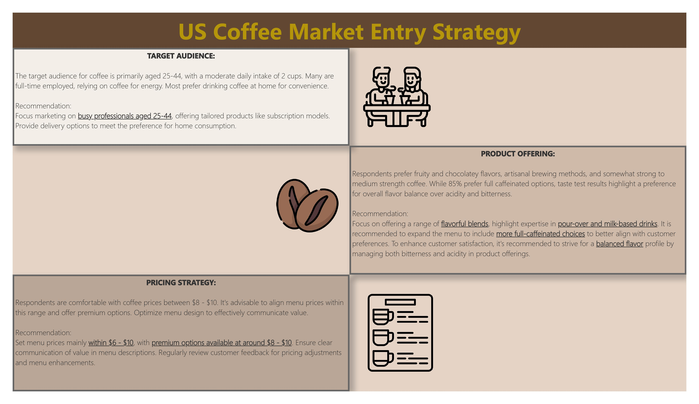

<h1 style="text-align:center; font-weight:bold;">Coffee Shop Entry Strategy</h1>

**Objective:**  
This project aims to identify target audience, product offering, and pricing strategies for a new coffee shop that utilizes dataset from a survey of American respondents.

**About the dataset:**  
This project aims to identify target audience, product offering, and pricing strategies for a new coffee shop that utilizes dataset from a survey of American respondents.

    
Target Audience

    

    
Product Offering

    

    
Pricing Strategy

    

    
Summary

    

